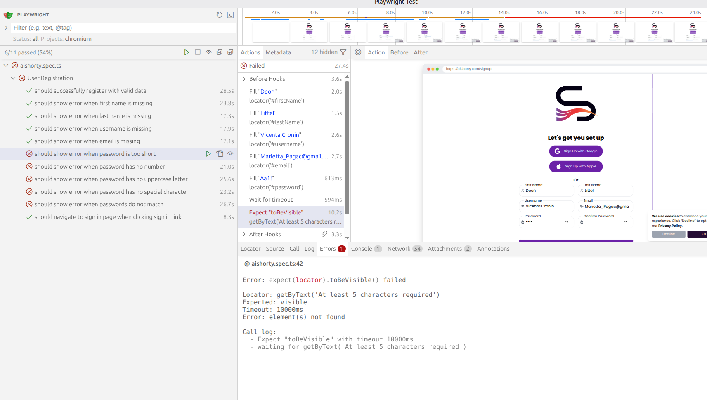

AI Shorty Test Automation

This repository contains an end-to-end testing suite for the AIShorty web application. It is designed to validate core user flows like Registration, Login, and Page Navigation across various browsers and mobile devices.

 Project Setup
Install dependencies:

npm install

Environment Setup: Create a .env.dev file in the root folder:

DEMOQA=https://aishorty.com

Run tests:

npx playwright test

Structure
pages/ - Selectors and page-specific actions.

tests/ - Test files (Signup, Login, etc.).

fixtures/ - Test setup and dependency injection.

playwright.config.ts - Framework settings and device configurations.
