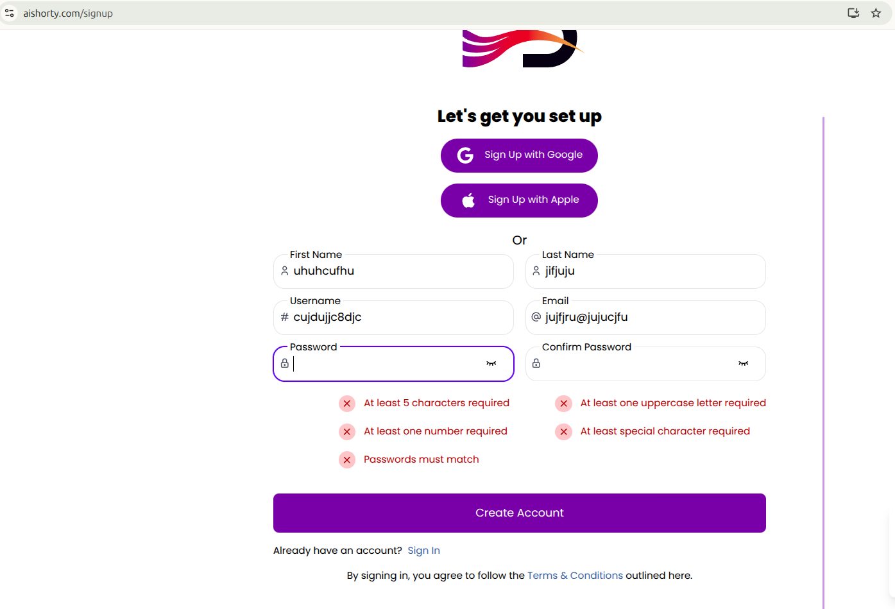
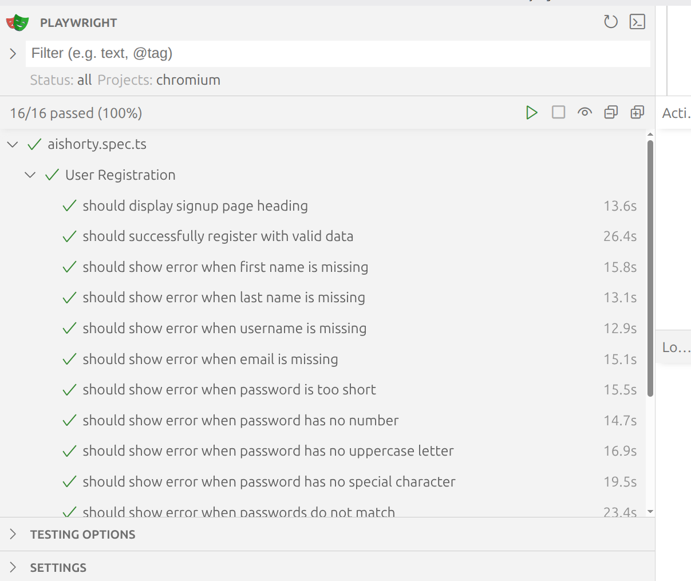
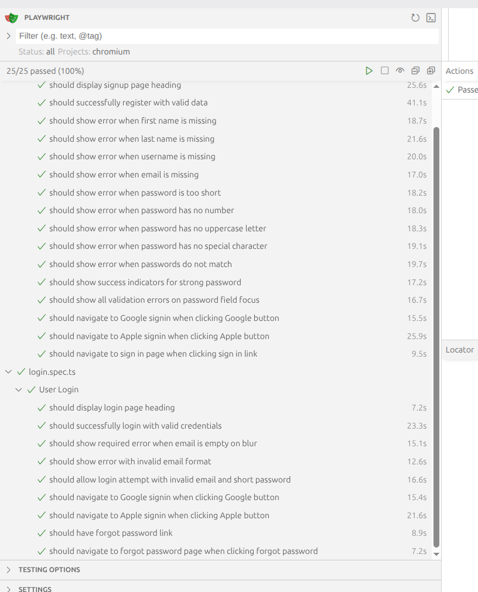

AI Shorty – Test Automation Suite

End-to-end test automation suite for the AIShorty web application, built with Playwright and TypeScript.
The suite validates critical user journeys such as Registration, Login, Social Authentication, and Page Navigation across multiple browsers and devices.

Project Overview

This project follows modern test automation best practices with a strong focus on:

Reliability (no flaky tests)

Readability and maintainability

Type safety

Enforced code quality through automation

Tech Stack

Playwright – Cross-browser end-to-end testing

TypeScript – Type-safe test development

Faker.js – Dynamic test data generation

dotenv – Environment variable management

ESLint + Perfectionist – Linting and code organization

Husky + lint-staged – Pre-commit quality enforcement

Features

### Page Object Model (POM) architecture

Cross-browser testing (Chromium, Firefox, WebKit)

Dynamic test data using Faker.js

Environment-based configuration

Social login flow testing (Google, Apple)

Comprehensive validation and navigation checks

Quick Start

### 1. Install Dependencies

npm install

### 2. Environment Configuration

Create a .env file in the project root:

DEMOQA=https://aishorty.com
TEST_USER_EMAIL=your-email@example.com
TEST_USER_PASSWORD=YourPassword123

3. Run Tests

Run all tests:

npx playwright test

Run tests in UI mode:

npx playwright test --ui

Run tests in headed mode:

npx playwright test --headed

Run a specific test file:

npx playwright test tests/your-test-file.spec.ts

4. View Test Report
   npx playwright show-report

### Development & Code Quality

To maintain a clean, stable, and professional test suite, strict quality rules are enforced.

1. Pre-commit Hooks (Husky)

This project uses Husky and lint-staged to prevent low-quality code from being committed.

Linting runs automatically on git commit

Commits are blocked if ESLint errors are found

Ensures the repository never contains broken or messy code

### 2. Linting & Formatting

We use ESLint with the Perfectionist plugin for consistent formatting and structure.

Run linter:

npm run lint

Auto-fix formatting issues:

npm run lint:fix

### 3. Best Practices Enforced

No hard waits
page.waitForTimeout()
Playwright auto-waiting assertions

await expect(locator).toBeVisible()

Alphabetical ordering
Imports, object keys, and class members must be sorted.

Type safety
Interfaces are required for structured data (e.g. RegistrationData).

String consistency
Use backticks (`) for all strings.

Test Results

Below are sample test execution results:

